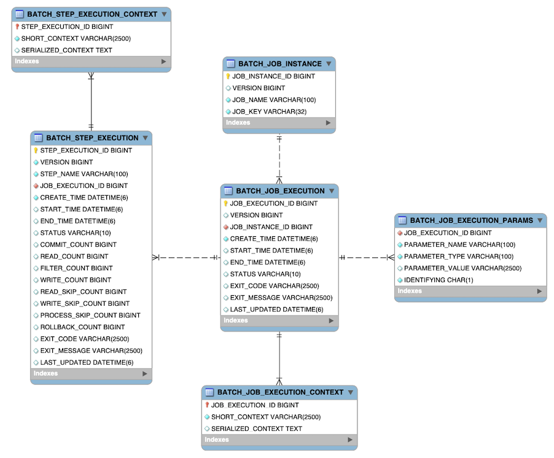

## Spring Batch

### Spring Batch에 필요한 셋팅
- spring-boot-starter-batch
- @EnableBatchProcessing 어노테이션 SpringApplication에 추가
- SpringBatch를 실행하기 위해 DataSource 추가 필요(여기에서는 memoryDB인 h2 사용)

### @EnableBatchProcessing 어노테이션의 역할
1. JobRepository 생성: 배치 메타데이터(작업 실행 상태, Step 상태 등)를 저장하는 역할, 이를 통해 SpringBatch는 배치 프로세스의 상태를 관리하고 추적할 수 있음

2. JobLauncher 생성: 배치 작업을 실행하는데 사용되는 인터페이스, JobLauncher를 통해 Job을 트리거하여 실행

3. JobBuilderFactory 및 StepBuilderFactory 생성: Job 및 Step을 구성하는 데 필요한 도우미 객체를 제공, 이를 통해 복잡한 배치 작업과 단계를 쉽게 정의

4. PlatformTransactionManager 생성: SpringBatch는 트랜잭션을 지원하기 때문에, 배치 프로세스에서 일관성과 복구 가능성을 보장하기 위해 트랜잭션 매니저 필요

5. 기본 설정 제공: @EnableBatchProcessing을 사용하면 Spring Batch에서 일반적으로 필요한 여러 구성 요소들에 대한 기본값을 자동으로 설정, 이를 통해 배치 설정의 복잡성을 줄이고, 필요한 경우 커스터마이징

### memoryDB 비교
- H2 Database
  - 메모리 데이터베이스: 주로 테스트 및 개발 전용으로 사용, 메모리에 데이터 저장
  - 경량/빠른속도
  - 자체 웹 콘솔 제공
``` yml
spring:
  datasource:
    hikari:
      maximum-pool-size: 10
    url: jdbc:h2:mem:testdb
    driver-class-name: org.h2.Driver
    username: sa
    password: password
```
``` gradle
implementation 'com.h2database:h2:2.2.224'
```

- HSQL Database
  - 경량 데이터베이스: 메모리 또는 파일 기반으로 데이터 저장
  - 자바 기반: Java 어플리케이션의 내장 데이터베이스로 사용 가능
  - SQL-92 호환: 표준 SQL 문법 지원
``` yml
spring:
  datasource:
    hikari:
      maximum-pool-size: 10
    url: jdbc:hsqldb:mem:testdb
    driver-class-name: org.hsqldb.jdbc.JDBCDriver
    username: sa
    password: password
```
```gradle
implementation 'org.hsqldb:hsqldb:2.7.2'
```

- Apache Derby Database
  - 특징
    - 자바 기반: Java 어플리케이션 내 내장 데이터베이스로 사용 가능
    - 네트워크 및 임베디드(내장) 모드
    - 트랜잭션(ACID) 지원
``` yml
spring:
  datasource:
    hikari:
      maximum-pool-size: 10
    url: jdbc:derby:memory:testdb;create=true
    driver-class-name: org.apache.derby.jdbc.EmbeddedDriver
    username: sa
    password: password
```
``` gradle
implementation 'org.apache.derby:derby:10.17.1.0'
```

각 데이터베이스에 맞는 설정 파일을 나눠 적고(application-{databaseName}.yml) application.yml에 profile.active에 h2 데이터베이스 설정을 해두었다.

### SpringBatch 스키마 구조

스프링배치를 수행하면 자동으로 배치를 위한 스키마 구조가 아래와 같이 생성



각 테이블에 대해 알아보자.

#### BATCH_JOB_INSTANCE Table
가장 기본이 되는 배치 잡 인스턴스 테이블이며, 배치가 수행되면 Job이 생성되고 해당 Job 인스턴스에 대해 관련된 모든 정보를 가진 최상위 테이블이다.
``` sql
CREATE TABLE BATCH_JOB_INSTANCE  (
    JOB_INSTANCE_ID BIGINT  PRIMARY KEY , -- 인스턴스에 대한 id, JobInstance 객체의 getId로 획득
    VERSION BIGINT, -- 버전
    JOB_NAME VARCHAR(100) NOT NULL , -- 배치잡 객체로 획득한 잡 이름, 인스턴스를 식별하기 위해 필요
    JOB_KEY VARCHAR(32) NOT NULL -- JobParameter를 직렬화한 데이터, 동일한 잡을 다른 잡과 구분하는 값
);
```

#### BATCH_JOB_EXECUTION_PARAMS Table
JobParameter에 대한 정보를 저장하는 테이블

하나 이상의 key-value 쌍으로 Job이 전달되며 job이 실행될 때 전달된 파라미터 정보를 저장하게 됨

각 파라미터는 IDENTIFYING이 true로 설정되면, JobParameter 생성시 유니크한 값으로 사용된 경우가 됨

``` sql
-- 기본키가 없는 테이블
CREATE TABLE BATCH_JOB_EXECUTION_PARAMS  (
    JOB_EXECUTION_ID BIGINT NOT NULL , -- BATCH_JOB_EXECUTION으로부터 온 외래, 각 실행마다 여러 (key-value) 저장
    PARAMETER_NAME VARCHAR(100) NOT NULL ,
    PARAMETER_TYPE VARCHAR(100) NOT NULL ,
    PARAMETER_VALUE VARCHAR(2500) ,
    IDENTIFYING CHAR(1) NOT NULL , -- 파라미터가 JobInstance의 유니크성을 위해 사용된 파라미터라면 true로 세팅
    constraint JOB_EXEC_PARAMS_FK foreign key (JOB_EXECUTION_ID)
    references BATCH_JOB_EXECUTION(JOB_EXECUTION_ID)
);
```

#### BATCH_JOB_EXECUTION Table

JobExecution과 관련된 모든 정보 저장

Job이 매번 실행될 때, JobExecution이라는 새로운 객체가 있으며 이 테이블에 새로운 row로 생성된다.

``` sql
CREATE TABLE BATCH_JOB_EXECUTION  (
  JOB_EXECUTION_ID BIGINT  PRIMARY KEY , -- 배치자 실행 id
  VERSION BIGINT, -- 버전
  JOB_INSTANCE_ID BIGINT NOT NULL, -- BATCH_JOB_INSTANCE의 기본키(외래키 설정), 하나의 인스턴스에 여러 execution 가능
  CREATE_TIME TIMESTAMP NOT NULL, -- execution이 생성된 시간
  START_TIME TIMESTAMP DEFAULT NULL, -- execution이 시작된 시간
  END_TIME TIMESTAMP DEFAULT NULL, -- execution이 종료된 시간, 성공/실패 무관하게 저장
  STATUS VARCHAR(10), -- execution의 현재 상태, (COMPLETED, STARTED 및 기타)
  EXIT_CODE VARCHAR(20), -- execution이 종료코드 
  EXIT_MESSAGE VARCHAR(2500), -- stack trace
  LAST_UPDATED TIMESTAMP, -- execution이 마지막으로 지속된 시간
  constraint JOB_INSTANCE_EXECUTION_FK foreign key (JOB_INSTANCE_ID)
  references BATCH_JOB_INSTANCE(JOB_INSTANCE_ID)
) ;
```
- END_TIME의 경우, 잡이 현재 실행중이 아닐때 열의 값이 비어있다면 특정 유형의 오류가 발생하여 프레임워크가 실패하기 전 마지막 저장을 수행할 수 없음을 나타냄

#### BATCH_STEP_EXECUTION Table

StepExecution과 관련된 모든 정보를 가진다.
이 테이블은 여러 면에서 BATCH_JOB_EXECUTION 테이블과 유사하며 생성된 각 JobExecution에 대한 단계당 항목이 항상 하나 이상이 있다.

``` sql
CREATE TABLE BATCH_STEP_EXECUTION  (
  STEP_EXECUTION_ID BIGINT NOT NULL PRIMARY KEY ,
  VERSION BIGINT NOT NULL,
  STEP_NAME VARCHAR(100) NOT NULL, -- execution에 귀속된 스텝의 이름
  JOB_EXECUTION_ID BIGINT NOT NULL, -- JobExecution에 StepExecution이 속한다 의미
  CREATE_TIME TIMESTAMP NOT NULL,
  START_TIME TIMESTAMP DEFAULT NULL ,
  END_TIME TIMESTAMP DEFAULT NULL, -- 수행중이 아닌데 이 값이 비어있다면, 에러가 발생했거나 실패하기 전 마지막 실패전 작업이 저장되지 않았음을 의미
  STATUS VARCHAR(10), -- COMPLETED, STARTED 외 기타 정보 상태 문자열 표현
  COMMIT_COUNT BIGINT , -- execution 동안 트랜잭션 커밋 수
  READ_COUNT BIGINT ,
  FILTER_COUNT BIGINT ,
  WRITE_COUNT BIGINT ,
  READ_SKIP_COUNT BIGINT ,
  WRITE_SKIP_COUNT BIGINT ,
  PROCESS_SKIP_COUNT BIGINT ,
  ROLLBACK_COUNT BIGINT , -- 이 실행동안 롤백된 아이템의 수, 재시도를 위한 롤백과 복구 프로시저에서 발생한 건 저장
  EXIT_CODE VARCHAR(20) ,
  EXIT_MESSAGE VARCHAR(2500) ,
  LAST_UPDATED TIMESTAMP,
  constraint JOB_EXECUTION_STEP_FK foreign key (JOB_EXECUTION_ID)
  references BATCH_JOB_EXECUTION(JOB_EXECUTION_ID) -- BATCH_JOB_EXECUTION에 대한 외래키 설정
) ;
```

#### BATCH_JOB_EXECUTION_CONTEXT Table
Job의 ExecutionContext에 대한 모든 정보를 저장함

매 JobExecution마다 정확히 하나의 JobExecutionContext를 가지고 특정 작업 실행에 필요한 모든 작업 수준 데이터가 포함되어 있음

이 데이터는 실패 후, 중단된 부분부터 시작될 수 있도록 실패후 검색해야 하는 상태를 나타냄

``` sql
CREATE TABLE BATCH_JOB_EXECUTION_CONTEXT  (
  JOB_EXECUTION_ID BIGINT PRIMARY KEY,
  SHORT_CONTEXT VARCHAR(2500) NOT NULL, -- SERIALIZED_CONTEXT 의 문자로된 버전
  SERIALIZED_CONTEXT CLOB, -- 직렬화된 전체 컨텍스트
  constraint JOB_EXEC_CTX_FK foreign key (JOB_EXECUTION_ID)
  references BATCH_JOB_EXECUTION(JOB_EXECUTION_ID)
) ;
```

#### BATCH_STEP_EXECUTION_CONTEXT Table

Step의 ExecutionContext와 관련된 모든 정보를 가짐

StepExecution 마다 정확히 하나의 ExecutionContext가 있고 특정 step execution에 대해 저장될 필요가 있는 모든 데이터가 저장됨

이 데이터는 JobInstance가 중단된 위치에서 시작할 수 있도록 실패후 검색해야 하는 상태를 나타냄

``` sql
CREATE TABLE BATCH_STEP_EXECUTION_CONTEXT  (
  STEP_EXECUTION_ID BIGINT PRIMARY KEY, -- 주어진 execution에 연관된 모든 row가 존재
  SHORT_CONTEXT VARCHAR(2500) NOT NULL,
  SERIALIZED_CONTEXT CLOB,
  constraint STEP_EXEC_CTX_FK foreign key (STEP_EXECUTION_ID)
  references BATCH_STEP_EXECUTION(STEP_EXECUTION_ID)
) ;
```

### SpringBatch Sequences
스프링배치에는 기본적으로 시퀀스 테이블이 존재함

- BATCH_JOB_SEQ: 배치 잡에 대한 시퀀스 테이블
- BATCH_JOB_EXECUTION_SEQ: 배치잡 execution의 시퀀스 테이블
- BATCH_STEP_EXECUTION_SEQ: 배치 스텝의 execution 시퀀스 테이블
