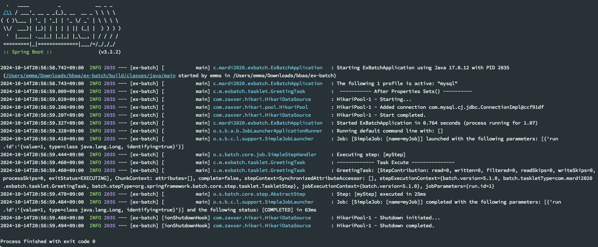
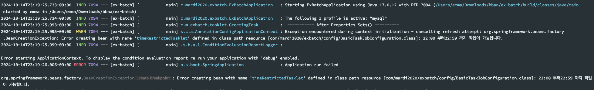
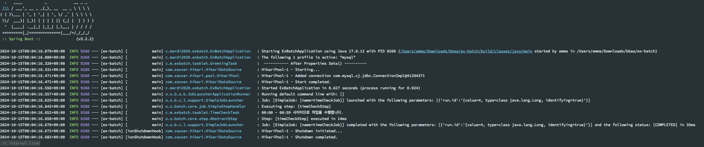
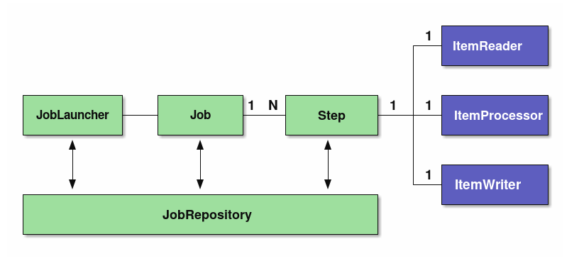
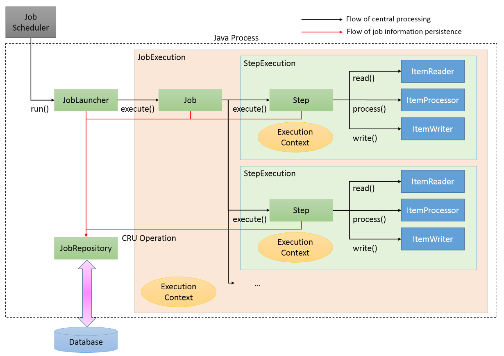

> 1. Tasklet 구현체 작성
> 2. Task Configuration 클래스 작성
> 3. Job, Step 생성하고 Bean 등록
> 4. 결과 확인

시작하기에 앞서서 SpringBatch 3.0 버전 이상에서는 `@EnableBatchProcessing`이 필요하지 않으므로 삭제한다.
``` java
@SpringBootApplication  
public class ExBatchApplication {  
  
    public static void main(String[] args) {  
        SpringApplication.run(ExBatchApplication.class, args);  
    }  
  
    @Bean  
    public static BeanDefinitionRegistryPostProcessor jobRegistryBeanPostProcessorRemover() {  
        return registry -> registry.removeBeanDefinition("jobRegistryBeanPostProcessor");  
    }  
  
}
```

## Tasklet 구현체 작성하기
- Tasklet: 배치 처리 중 사용, 대개 외부 리소스(데이터베이스 연결 등)을 다룸
    - 배치 작업 시작 전, 미리 필요한 리소스들을 준비하거나 설정해야 함
``` java
@Slf4j  
public class GreetingTask implements Tasklet, InitializingBean {  
  
    /**  
     * Tasklet의 구현 메서드  
     * @param contribution mutable state to be passed back to update the current step  
     * execution     
     * @param chunkContext attributes shared between invocations but not between restarts  
     * @return RepeatStatus (FINISHED: 태스크릿이 종료됨, CONTINUABLE: 계속해서 태스크 수행,  
     *    continueIf(condition): 조건에 따라 종료할지 지속할지 결정하는 메소드이며 종료/지속 결정함)  
     * @throws Exception  
     */  
    @Override  
    public RepeatStatus execute(StepContribution contribution,  
                                ChunkContext chunkContext) throws Exception {  
  
        log.info("------------- Task Excute ---------------");  
        log.info("GreetingTask: {}, {}", contribution, chunkContext);  
        return RepeatStatus.FINISHED;  
    }  
  
    /**  
     * InitializingBean의 메서드  
     * task를 수행할때 프로퍼티를 설정하고 난 뒤, 수행되는 메서드 없어도 됨!  
     * @throws Exception  
     */  
    @Override  
    public void afterPropertiesSet() throws Exception {  
        log.info(" ----------- After Properties Sets() ----------");  
    }  
}
```
- InitializingBean의 afterpropertiesSet()의 역할
    - SpringBatch에서 사용되는 특정 빈들은 초기화 단계에서 추가 설정이나 리소스 준비를 해야 하는 경우가 많음, 이러한 초기화 작업을 위해 위의 메서드를 활용
    - 해당 메서드는 bean이 생성된 후 모든 의존성이 주입된 직후 호출 -> 데이터베이스 연결이나 외부 API 설정 등 DI가 완료되고 직후에 설정되어야 함
    - 그래서 사용에 따라 달라서 필수로 구현해야 하는 것은 아님

execute() 메서드 내부에서 사용하는 RepeatStatus enum 타입 코드
``` java
public enum RepeatStatus {  
  
   /**  
    * Indicates that processing can continue.    */   
	CONTINUABLE(true),  
   /**  
    * Indicates that processing is finished (either successful or unsuccessful)    */   
    FINISHED(false);  
  
   private final boolean continuable;  
  
   RepeatStatus(boolean continuable) {  
      this.continuable = continuable;  
   }  
  
   public static RepeatStatus continueIf(boolean continuable) {  
      return continuable ? CONTINUABLE : FINISHED;  
   }  
  
   public boolean isContinuable() {  
      return this == CONTINUABLE;  
   }  
  
   public RepeatStatus and(boolean value) {  
      return value && continuable ? CONTINUABLE : FINISHED;  
   }  
  
}
```
- RepeatStatus는 CONTINUABLE, FINISHED 두 가지 상태를 가짐
    - CONTINUABLE: 계속 실행할 수 있는 상태
        - 현재 Tasklet이 완전히 끝나지 않고 추가 처리가 필요함을 알림 -> 계속 작업해야 해!
        - 한번에 많은 데이터를 처리하는 경우에 유용
            - 즉, 데이터를 청크단위로 처리할 때 이 상태를 반환하여 남은 데이터를 계속 처리할 수 있도록 할 수 있음

  그렇다면 왜 단 두가지 상태를 가지는지?
    - 간단한 흐름 제어: 배치 작업은 반복적이고 일괄 처리이므로 작업의 완료 혹은 미완료만으로도 표현 가능
    - 재시도 및 반복 처리 용이
    - 명확한 목적: Tasklet은 간단한 작업의 단위, 작업을 수행하고 나서 그 작업이 끝났는지 여부를 알리는 것
- and() 메서드: 다중 조건을 연결함
- continueIf(): 조건에 따라 배치 작업을 계속할지 여부를 결정하는 메서드
    - 조건부 흐름 제어를 위해 사용 - 특정 조건이 만족될 때 다음 단계로 넘어갈 수 있음
``` java
@Bean public Job job(JobBuilderFactory jobBuilderFactory, Step step1, Step step2) { 
	return jobBuilderFactory.get("myJob") 
				.start(step1) 
				.on("COMPLETED") // step1이 완료된 경우 
				.to(step2) // step2로 넘어가는데 
				.continueIf(myCondition()) // 조건이 true일 때만 계속 
				.end() 
				.build(); 
} 
public Boolean myCondition() { // 조건을 평가하는 로직 
	return true; // 또는 조건에 따른 결과 
}
```

## @Configuration 작성
방금 전 작성한 tasklet을 빈으로 등록하고, step, job도 빈으로 등록
``` java
@Slf4j  
@Configuration  
@RequiredArgsConstructor  
public class BasicTaskJobConfiguration {  
  
    private final PlatformTransactionManager transactionManager;  
  
    @Bean  
    public Tasklet greetingTasklet() {  
        return new GreetingTask();  
    }  
  
    /**  
     * step을 spring bean으로 등록  
     * @param jobRepository 배치 작업의 상태를 저장하고 관리  
     * @return 생성된 step  
     */    @Bean  
    public Step step(JobRepository jobRepository) {  
        return new StepBuilder("myStep", jobRepository)  
                .tasklet(greetingTasklet(), transactionManager)  
                .build();  
    }  
  
    /**  
     * step, jobRepository가 필요한 job을 생성  
     * incrementer: 잡이 지속적으로 실행될 때 잡의 unique함을 보장하는 방법 설정  
     * RunIdIncrementer: 잡의 id를 지속적으로 증가시키면서 unique함 유지  
     * start(step): job의 시작포인트를 잡음  
     * @param step step 정보  
     * @param jobRepository job을 등록함  
     * @return job 빌더로 생성  
     */  
    @Bean  
    public Job myJob(Step step, JobRepository jobRepository) {  
        return new JobBuilder("myJob", jobRepository)  
                .incrementer(new RunIdIncrementer())  
                .start(step)  
                .build();  
    }  
  
}
```
## 실행



afterPropertySet() -> Job -> Step -> Tasklet 순으로 실행됨

### 특정 시간대에만 가능한 tasklet 예제
- TimeCheckTask 클래스
``` java
@Slf4j  
public class TimeCheckTask implements Tasklet, InitializingBean {  
  
    private final LocalTime startTime;  
  
    private final LocalTime endTime;  
  
    private final ZoneId zoneId;  
  
    @Builder  
    public TimeCheckTask(LocalTime startTime, LocalTime endTime, ZoneId zoneId) {  
        this.startTime = startTime;  
        this.endTime = endTime;  
        this.zoneId = zoneId;  
    }  
  
    @Override  
    public RepeatStatus execute(@NonNull StepContribution contribution,  
                                @NonNull ChunkContext chunkContext) throws Exception {  
        log.info("오후 10시 ~ 10시 59분 사이이므로 작업을 수행합니다.");  
        return RepeatStatus.FINISHED;  
    }  
  
    @Override  
    public void afterPropertiesSet() throws Exception {  
        ZonedDateTime now = ZonedDateTime.now();  
        LocalTime currTime = now.toLocalTime();  
  
        if (currTime.isBefore(startTime) || currTime.isAfter(endTime)) {  
            throw new IllegalArgumentException(startTime + " 부터" + endTime + " 까지 작업이 가능합니다.");  
        }  
    }  
}
```
Job은 하나만 등록되거나 JobRegistry에서 관리하고 CommandLineJobRunner 를 통해 동적으로 선택할 수 있다고 한다. 여기서는 간단하게 돌려보는 용도로 기존의 myStep, myJob에 @Bean 애노테이션을 잠깐 주석처리 하겠다.

- TaskJobConfiguration
``` java
@Bean  
public Tasklet timeCheckTask() {  
    return TimeCheckTask.builder()  
            .startTime(LocalTime.of(22, 0)) // 수행 start time
            .endTime(LocalTime.of(22, 59))  // 수행 end time
            .zoneId(ZoneId.of("Asia/Seoul"))  // zone 시간대
            .build();  
}

@Bean  
public Step timeCheckStep(JobRepository jobRepository) {  
    return new StepBuilder("timeCheckStep", jobRepository)  
            .tasklet(timeCheckTask(), transactionManager)  
            .build();  
}  
  
@Bean  
public Job timeCheckJob(Step timeCheckStep, JobRepository jobRepository) {  
    return new JobBuilder("timeCheckJob", jobRepository)  
            .incrementer(new RunIdIncrementer())  
            .start(timeCheckStep)  
            .build();  
}
```
timeCheckTask() 에 startTime, endTime, timeZone을 설정해주고 빈으로 등록한 다음, step과 job을 교안 내용처럼 작성해 주었다.

현재 시간은 오후 11시 24분이기 때문에, 아래와 같이 에러가 발생한다.


시간대를 오후 12시에서 12시 59분 사이로 변경한다면, 성공적으로 작업을 수행했다고 뜬다.


그렇다면, 시간대 체크는 afterPropertiesSet()말고 execute()에서도 가능한 것이 아닌가?
- afterPropertiesSet()에서 확인할 경우
    - 빈이 생성된 후 모든 의존성 주입이 완료되고 나서 한번만 호출됨
    - 즉, 배치 작업이 시작되기 전에 확인하므로 배치 작업이 아예 시작되지 않을 수 있다.
- execute()에서 확인할 경우
    - 배치 작업이 실행될 때마다 호출
    - 즉, 실제 작업을 수행하기 직전에 시간대 검증을 매번 함
    - 만약, 배치 작업 시작을 9시 59분에 했지만, 10시가 될때에는 배치 작업이 수행되어야 한다면..?
  
**결론)** 배치 작업의 검증 시점이나 요구사항에 따라 다르게 사용해야 할듯..??

## Spring Batch 구조
- Tasklet model: 단순한 로직을 처리하는데 특화된 모델, 다양한 데이터소스나 파일을 한번에 처리해야 하는 경우
- Chunk model: 데이터가 매우 큰 경우, Reader/Processor/Writer 플로우 방식으로 처리




- Job: 배치 작업의 전체 실행 단위, 여러 step을 포함하여 전체 배치 작업의 흐름을 정의함
- Step: Job의 구성요소, 실제 처리 작업을 담당함, 하나의 Step은 하나의 Tasklet을 실행하거나 ItemReader, ItemProcessor, ImterWriter를 사용한 청크 기반 처리를 담당
- JobLauncher: Job을 실행하는 컴포넌트
- ItemReader: 배치 작업에서 데이터 소스로부터 데이터를 읽어오는 역할, 하나씩 읽어 ItemProcessor로 전달
- ItemProcessor(옵션값): ItemReader로부터 읽은 데이터를 가공하거나 변환하는 역할, 읽은 데이터를 처리한 후, ItemWriter로 데이터를 전달
- ItemWriter: 처리된 데이터를 최종적으로 출력하는 역할, 파일에 기록되던지 디비에 저장되던지, 외부 시스템으로 전달됨
- Tasklet: 단일 작업을 수행하는 구성 요소, 주로 단일 태스크를 처리함
- JobRepository: 배치 작업의 실행 정보를 저장하거나 관리하는 역할, Job과 Step의 실행 상태, 이력등을 디비에 저장하고 관리

## 스프링 배치의 흐름



**처리 흐름 관점**
1. JobScheduler가 배치를 트리거하여 JobLauncher 실행 
2. JobLauncher가 JobExecution 수행 및 ExecutionContext 정보를 이용하여 Job 실행 
3. Job이 정의된 Step 실행, StepExecution 수행 및 ExecutionContext 정보 전달 
4. Step은 Tasklet 또는 Chunk 모델로 처리되며, 이 경우 Chunk 모델로 처리
   - ItemReader가 데이터를 읽어옴
   - ItemProcessor가 데이터를 가공 또는 변환
   - ItemWriter가 처리된 데이터를 파일이나 데이터베이스에 저장
   
**Job 정보 흐름 관점** 
1. JobLauncher가 JobRepository를 통해 JobInstance 정보를 디비에 등록 
2. JobLauncher가 JobExecution을 통해 Job을 수행하고 실행 정보를 디비에 저장 
3. JobStep(??)은 JobRepository를 통해 I/O 레코드와 상태 정보 저장 
4. 잡이 완료되면 JobRepository에 완료 정보 저장

**스프링 배치 저장 정보**
- JobInstance: 잡 이름과 전달된 파라미터 정의. 중단된 경우 재실행 시 중단 지점부터 수행 가능
- JobExecution/ExecutionContext
  - JobExecution: 잡의 물리적 실행. JobInstance와 일대다 관계(동일한 Job이 여러번 수행될 수 있기 때문) 
  - ExecutionContext: JobExecution 단계에서 메타 정보를 공유하는 영역(java.io.Serialized 구현 클래스 필수)
- StepExecution/StepExecutionContext
  - StepExecution: Step의 물리적 실행. Job과 일대다 관계(Job은 여러 Step을 수행하므로)
  - StepExecutionContext: 각 Step 내의 데이터를 공유하는 영역. Serializable을 구현해야 함
- JobRepository: JobExecution과 StepExecution 등의 실행 정보, 상태, 결과 정보를 저장
