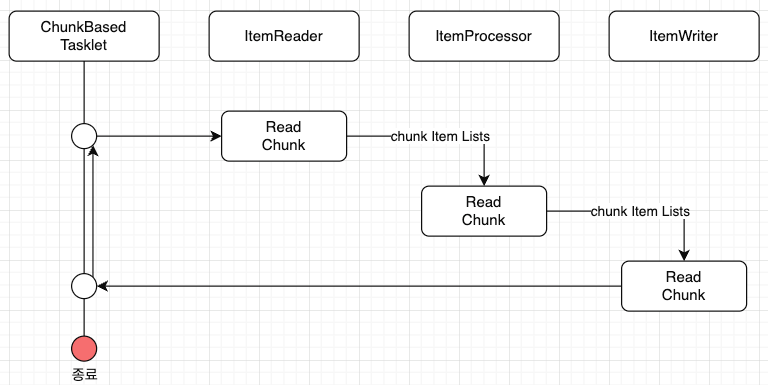

## Chunk model
> chunk model: 처리할 데이터를 일정한 청크 단위로 처리하는 방식
> 
> 큰 데이터를 분할해서 `ItemReader --> ItemProcessor --> ItemWriter `순으로 처리가 필요한 경우 매우 유용

- ChunkOrientedTasklet: 청크 처리를 지원하는 Tasklet의 구현체 역할 수행
- 청크에 포함될 최대 레코드 수(chunk size): `commit-interval` 설정 값으로 조정 가능
- ItemReader, ItemProcessor, ItemWriter 는 청크 단위를 처리하기 위한 인터페이스

그렇다면 적절한 chunk size는 어떻게 찾을 수 있을까???
- 데이터 크기, 시스템 자원, 트랜잭션 등등 요인들을 분석하고... chatGPT에 의하면 초기 설정값을 10~100??사이로 두고 성능 테스트 등을 통하여 테스트하여 찾는다고 한다

데이터의 용량이 엄청 큰데, chunk size가 매우 작다면 그만큼 트랜잭션 작업이 많이 발생하므로 성능 저하 및 비효율적일듯 + I/O 작업도 그만큼 많아짐...



- ChunkOrientedTasklet: ItemReader, ItemProcessor, ItemWriter 구현체를 호출함
  - 청크 단위로 인터페이스를 구현한 세 구현체를 반복 실행
  - 청크 크기만큼 ItemReader가 데이터를 읽어오고
  - 청크 단위로 ItemProcessor로 데이터를 전달하고 용도에 맞게 처리
  - ItemProcessor에서 처리가 완료된 청크 단위 데이터를 ItemWriter로 전달해 저장하거나 파일 처리 수행

### ✅ ItemReader

#### FlatFileItemReader
> 구조화 되지 않은 파일(flat file, 대표적으로 csv)을 읽어고 읽어들인 데이터를 객체로 매핑하기 위해 구분자를 기준으로 객체 매핑, 혹은 입력에 대해 Resource object를 이용해 커스텀 매핑도 가능

#### StaxEventItemReader
> xml 파일을 StAX[1] 기반으로 read

#### JdbcPagingItemReader / JdbcCursorItemReader
> JDBC 사용하여 SQL을 실행하고 데이터베이스의 레코드를 읽어 들임
- 데이터베이스에서 많은 양의 데이터를 처리해야 하는 경우에는 메모리에 있는 모든 레코드를 읽는 것을 피하고, 한 번의 처리에 필요한 데이터만 읽고 폐기해야 함
- `JdbcPagingItemReader`: JdbcTemplate을 이용하여 각 페이지에 대한 SELECT SQL을 나누어 처리하는 방식
- `JdbcCursorItemReader`: JDBC 커서를 이용하여 하나의 SELECT SQL을 발행해 구현

그외 `MyBatisCursorItemReader / MyBatisPagingItemReader`, `JmsItemReader / AmqpItemReader` 도 있음

### ✅ ItemProcessor

#### PassThroughItemProcessor
> 아무 작업도 수행하지 않으며 입력된 데이터의 변경이나 처리가 필요하지 않을 때 사용

#### ValidatingItemProcessor
> 입력된 데이터를 확인(`org.springframework.batch.item.validator.Validator`으로 입력 확인 규칙 구현 가능)
> 하지만 일반적인 `org.springframework.validation.Validator` 의 어댑터인 `SpringValidator`와 `org.springframework.validation`의 규칙을 제공

```java

@Configuration
public class BatchConfig {
    // ...
    @Bean
    public ValidatingItemProcessor<Item> itemProcessor() {
        ValidatingItemProcessor<Item> validatingItemProcessor = new ValidatingItemProcessor<>(item -> {
          if (item.getName().isNotOk()) {
            throw new ValidationException("validation exception");
          }
        });
        validatingItemProcessor.setFilter(true);
        return validatingItemProcessor;
    }
}
```
#### CompositeItemProcessor
> 동일한 입력 데이터에 대해 여러 ItemProcessor를 순차적으로 실행, `ValidatingItemProcessor`로 입력 확인 수행 후, 비즈니스 로직을 실행하려는 경우 활성화 됨

### ✅ ItemWriter

#### FlatFileItemWriter
> 처리된 Java 객체를 csv 파일과 같은 플랫 파일로 작성, 파일 라인에 대한 mapping 규칙은 구분자 및 사용자 정의로 사용 가능

- DelimitedLineAggregator: 각 필드 사이의 구분자 설정, `setDelimiter(",")`를 통해 설정
- FieldExtractor: 파일에 쓸 데이터를 추출, 예를 들어 `PassThroughFieldExtractor`는 입력 데이터를 그대로 출력에 전달하는 구현체

#### StaxEventItemWriter
> xml 파일로 자바 객체 write

#### JdbcBatchItemWriter
> JDBC를 사용해 SQL을 수행하고 자바 객체를 데이터베이스에 write, JdbcTemplate 사용

그외 `MyBatisBatchItemWriter`, `JmsItemWriter / AmqpItemWriter` 도 있음

## Tasklet Model
> 청크 단위의 처리가 딱 맞지 않을경우 Tasklet Model이 유용
- 한번에 하나의 레코드만 읽어서 쓰기를 해야될 때, Tasklet model이 적합

### Tasklet 구현클래스

#### ✅ SystemCommandTasklet
> 시스템 명령어를 비동기적으로 실행하는 Tasklet, 명령 속성에 수행해야할 명령어를 지정해 사용 가능
- 시스템 명령은 호출하는 스레드와 다른 스레드에 의해 실행되므로 프로세스 도중 TIME OUT을 설정하고, 시스템 명령의 실행 스레드를 취소할 수 있음

#### ✅ MethodInvokingTaskletAdapter
> POJO[2] 클래스의 특정 메소드를 실행하기 위한 Tasklet
> 
> 즉, Tasklet 인터페이스 구현없이 기존의 메서드 호출으로 배치 작업을 수행할 수 있도록 해주는 어댑터 클래스

- targetObject 속성에 대상 클래스의 빈을 지정하고, targetMethod 속성에 실행할 메소드 이름 지정
- POJO 클래스는 일괄 처리 종료 상태를 메소드의 반환 값으로 반환이 가능하지만, 이 경우 원래는 ExitStatus를 반환값으로 설정해야 함
- 다른 타입의 값이 반환될 경우 반환값과 상관없이 "정상 종료(ExitStatus:COMPLETED)" 상태로 간주됨

---
### 용어
[1] StAX: XML 파일을 메모리에 전부 로드하지 않고 스트리밍 방식으로 처리할 수 있는 효율적인 API

[2] POJO: Plain Old Java Object, 특별한 요구사항이나 복잡한 프레임워크 없이 작성된 순수한 자바 객체