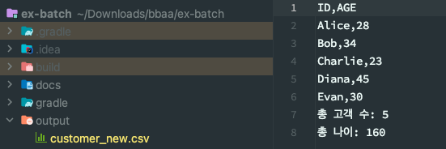

> FlatFileItemReader와 FlatFileItemWriter

## FlatFileItemReader
> Spring Batch에서 제공하는 기본적인 **ItemReader**로 텍스트 파일로부터 데이터를 읽어오며 고정길이, 구분자, 멀티 라인등 다양한 형식의 텍스트 파일을 지원

장점
- 간단하고 효율적인 구현 - 대규모 데이터 처리에도 효율적
- 다양한 텍스트 파일 형식 지원
- 확장 가능성 - tokenizer, filter 등을 통해 기능 확장 가능

단점
- 복잡한 데이터(비정형 데이터)는 처리가 어려움

주요 구성 요소
- Resource: 읽을 텍스트 파일 지정
- LineMapper: 텍스트 파일의 각 라인을 Item으로 변환
- LineTokenizer: 텍스트 파일의 각 라인을 토큰으로 분리
- FieldSetMapper: 토큰을 Item의 속성에 mapping
- SkippableLineMapper: 오류 발생시 해당 라인을 건너뛸 수 있음
- LineCallbackHandler: 라인별로 처리를 수행
- ReadListener: 읽기 시작, 종료, 오류 발생 등의 이벤트 처리 기능

### 실습 코드
``` java
@Getter
@Setter
public class Customer {

	private String name;

	private int age;

	private String gender;
}
```
#### Customer를 읽어올 FlatFileItemReader
``` java
@Bean
public FlatFileItemReader<Customer> customerFlatFileItemReader() {
	return new FlatFileItemReaderBuilder<Customer>{}
			.name("CustomerFlatFileItemReader")
			.reesource(new ClassPathResource("./customer.csv")) // classPath 내부에 존재하는 csv 읽어오기
			.encoding(ENCODING)
			.delimited().delimiter(",")
			.names("name", "age", "gender") // 구분자로 구분된 데이터의 이름 지정
			.targetType(Customer.class) // 구분된 데이터를 어느 모델에 넣을지 클래스 타입 지정
			.build();
			
}
```

FlatFileItemReader: , 로 구분된 단순한 구조의 flat file인 csv 파일을 읽어오도록 작성

만약 csv 파일 라인에 형식에 맞지 않는 다른 타입이나, 형태가 저장되어 있다면 건너뛰게 설정할 수 있다. step 생성하는 곳에 아래와 같이 코드를 추가하고 customer.csv 에 형식에 안맞는 라인을 추가하여 테스트 해보았다.
``` java
// stepBuilder
.faultTolerant()
.skipPolicy((exception, skipCount) -> exception instanceof FlatFileParseException) // ...
```
- skipPolicy는 faultTolerant() 호출후 추가할 수 있다
- skipCount는 특정 스킵 횟수에 도달하면 작업을 도중에 멈출 수 있다.
추가하지 않았을 떄
```
org.springframework.batch.item.file.FlatFileParseException: Parsing error at line: 3 in resource=[class path resource [customer.csv]], input=[스킵해야될 라인 추가]
```
exception이 발생했으나 코드를 추가하고서 정상적으로 output이 생성됨을 확인할 수 있었다.

## FlatFileItemWriter
> Spring Batch에서 제공하는 ItemWriter 인터페이스의 구현체, 데이터를 텍스트 파일로 출력하는데 사용

장점
- 간편성: 텍스트 파일로 데이터를 출력할 수 있음
- 유연성: 다양한 설정을 통해 원하는 형식으로 출력 파일 생성
- 성능: 대량의 데이터를 빠르게 출력 가능

단점
- 형식 제약: 텍스트 형식만 지원
- 복잡한 구조: 복잡한 구조의 데이터를 출력할 때에는 설정이 복잡해짐
- 오류 가능성: 설정 오류시 출력 파일이 손상될 수 있음

구성요소
- Resource: 출력 파일 경로 지정
- LineAggregator: Item을 문자열로 변환
- HeaderCallback: 출력 파일 헤더 작성
- FooterCallback: 출력 파일 푸터 작성
- Delimiter: 구분자 지정
- AppendMode: 기존 파일에 추가할지 여부 지정

### 실습 코드
``` java
@Bean
public FlatFileItemWriter<Customer> flatFileItemWriter() {
  return new FlatFileItemWriterBuilder<Customer>()
               .name("flatFileItemWriter") // item writer의 이름 지정
                .resource(new FileSystemResource("./output/customer_new.csv")) // 저장할 최종 파일 이름
                .encoding(ENCODING)
                .delimited().delimiter("\t")
                .names("Name", "Age", "Gender")
                .append(false) // true: 기존 파일 첨부, false: 새로운 파일 생성
                .lineAggregator(new CustomerLineAggregator()) // 라인 구분자 지정
                .headerCallback(new CustomerHeader()) // 출력 파일의 헤더 지정
                .footerCallback(new CustomerFooter(aggregateInfos)) // 출력 파일의 푸터를 지정
                .build();
}
```

#### CustomerLineAggregator
- LineAggregator: flat file에 저장할 아이템들을 스트링으로 변환하는 방법을 지정할 수 있음
- aggregate를 override하여 item 객체를 string으로 변경할 수 있음
``` java
public class CustomerLineAggregator implements LineAggregator<Customer> {
    @Override
    public String aggregate(Customer item) {
        return item.getName() + "," + item.getAge();
    }
}
```

#### CustomerHeader와 CustomerFooter
``` java
public class CustomerHeader implements FlatFileHeaderCallback {
    @Override
    public void writeHeader(Writer writer) throws IOException {
        writer.write("ID,AGE");
    }
}

@Slf4j
public class CustomerFooter implements FlatFileFooterCallback {
    ConcurrentHashMap<String, Integer> aggregateCustomers;

    public CustomerFooter(ConcurrentHashMap<String, Integer> aggregateCustomers) {
        this.aggregateCustomers = aggregateCustomers;
    }

    @Override
    public void writeFooter(Writer writer) throws IOException {
        writer.write("총 고객 수: " + aggregateCustomers.get("TOTAL_CUSTOMERS"));
        writer.write(System.lineSeparator());
        writer.write("총 나이: " + aggregateCustomers.get("TOTAL_AGES"));
    }
}
```

#### AggregateCustomerProcessor
``` java
@Slf4j
public class AggregateCustomerProcessor implements ItemProcessor<Customer, Customer> {

    ConcurrentHashMap<String, Integer> aggregateCustomers;

    public AggregateCustomerProcessor(ConcurrentHashMap<String, Integer> aggregateCustomers) {
        this.aggregateCustomers = aggregateCustomers;
    }

    @Override
    public Customer process(Customer item) throws Exception {
        aggregateCustomers.putIfAbsent("TOTAL_CUSTOMERS", 0);
        aggregateCustomers.putIfAbsent("TOTAL_AGES", 0);

        aggregateCustomers.put("TOTAL_CUSTOMERS", aggregateCustomers.get("TOTAL_CUSTOMERS") + 1);
        aggregateCustomers.put("TOTAL_AGES", aggregateCustomers.get("TOTAL_AGES") + item.getAge());
        return item;
    }
}
```

### 실행
먼저 src/main/resources 에 customer.csv 파일을 추가했다.
``` csv
Alice,28,Female
Bob,34,Male
Charlie,23,Male
Diana,45,Female
Evan,30,Male
```
스프링 배치 애플리케이션 실행 후, output 디렉토리에 output csv가 생성된다.
#### 결과
